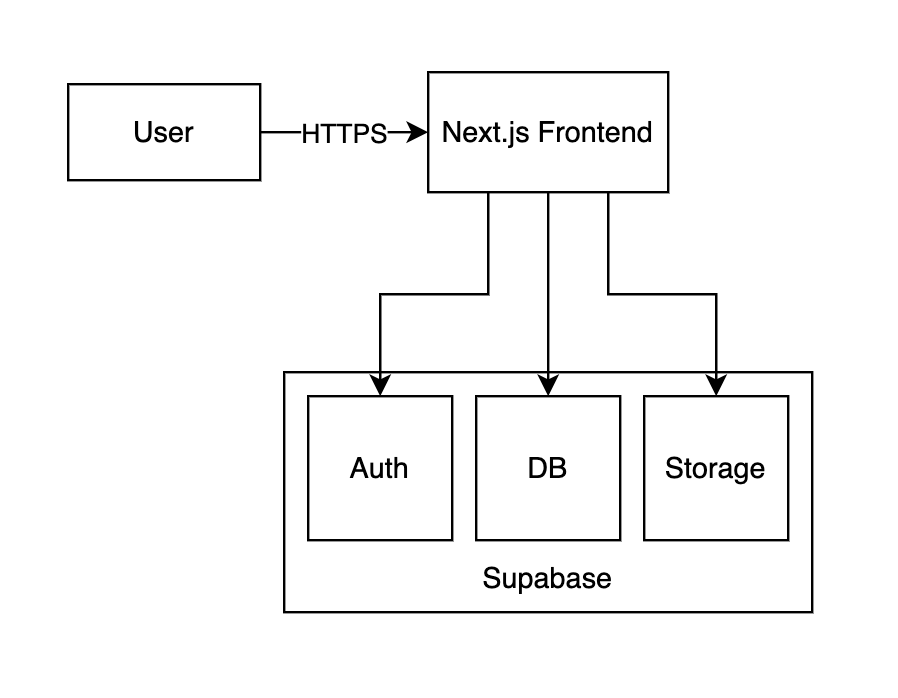

# JamSesh Technical Documentation

---


## 1. Codebase Overview & Structure

JamSesh is a web application built with Next.js (React), TypeScript, Tailwind CSS, and Supabase. The codebase is organized for clarity and rapid prototyping.

**Key Directories:**
- `src/app/` — Next.js app directory (routes, pages, API handlers)
- `src/components/` — Reusable React components (forms, modals, feed, etc.)
- `src/lib/` — Utility functions, Supabase client, helpers
- `public/` — Static assets (images, favicon, etc.)
- `docs/` — Project documentation

**Entry Point:**
- `src/app/page.tsx` — Main landing page (feed)

---

## 2. How to Add Features or Make Changes

- **Add a new page:** Create a new file in `src/app/` (e.g., `src/app/new-page/page.tsx`).
- **Add a new component:** Place it in `src/components/` and import where needed.
- **State management:** Most state is local or lifted to parent components. No global state library is used.
- **Styling:** Use Tailwind CSS utility classes. Custom styles can go in `globals.css`.
- **Supabase:** Use the `supabase` client from `src/lib/supabaseClient.ts` for all DB/auth/storage operations.
- **Testing:** Manual/local testing is recommended. No automated test suite is included (prototype).

---

## 3. API Usage (Supabase)

JamSesh uses Supabase for all backend functionality:
- **Auth:** Email/password sign up and login
- **Database:** Postgres tables for users, profiles, posts, etc.
- **Storage:** For user avatars and media

**No custom REST endpoints** are defined; all data access is via Supabase client SDK.

**Example (fetch posts):**
```ts
const { data, error } = await supabase
  .from('posts')
  .select('*')
  .order('created_at', { ascending: false });
```

**RLS (Row Level Security):** Enabled for all tables. Policies allow users to read public data and modify their own records.

---

## 4. Database Schema & Data Dictionary

**Main Tables:**

### `profiles`
| Column       | Type      | Description                       |
|--------------|-----------|-----------------------------------|
| id           | uuid      | Primary key (matches auth user id) |
| username     | text      | Unique display name                |
| bio          | text      | User bio/about section             |
| avatar_url   | text      | Path to avatar in Supabase Storage |
| instruments  | text[]    | Array of instrument tags           |
| created_at   | timestamp | Profile creation date              |

### `posts`
| Column       | Type      | Description                       |
|--------------|-----------|-----------------------------------|
| id           | uuid      | Primary key                       |
| user_id      | uuid      | Foreign key to profiles.id         |
| title        | text      | Post title                        |
| body         | text      | Post content (rich text HTML, TipTap) |
| category     | text      | Post category (e.g., 'Show', 'Looking for Musicians') |
| location     | text      | City or region                    |
| latitude     | float     | Latitude for map pin              |
| longitude    | float     | Longitude for map pin             |
| thumbnail_url| text      | Thumbnail image URL (Supabase Storage) |
| created_at   | timestamp | Post creation date                 |

---

## 5. Architecture & Diagrams

JamSesh is a modern web application designed for musicians to connect and collaborate. The architecture is simple, scalable, and leverages managed services to minimize backend complexity.

- **Frontend:** Built with Next.js (React), TypeScript, and Tailwind CSS. Handles all user interaction, routing, and UI rendering.
- **Backend:** Powered by Supabase, which provides authentication, a Postgres database, and file storage. All data operations are performed via the Supabase client SDK.
- **Deployment:** The frontend is intended for deployment on Vercel (or similar platforms).

### Architecture Diagram

Below is a visual representation of the JamSesh system architecture:



### Data Flow

1. **User** interacts with the web app via their browser.
2. **Next.js Frontend** handles UI, routes, and calls Supabase for data, authentication, and storage.
3. **Supabase** manages:
   - **Auth:** User sign-up, login, and session management
   - **Database:** Storing user profiles, posts, etc.
   - **Storage:** Media files (avatars, images)
4. All data is protected by Row Level Security (RLS) policies in Supabase.

---

## 6. Known Issues & Future Work
- No automated tests (manual testing only)
- No production deployment (prototype only)
- Some features (group profiles, interactive poster board, music integration) are stretch goals.
- UI/UX polish and accessibility improvements are ongoing
- **Documentation may become outdated as the project evolves.** Please review and update this document as features or architecture change.

See the [Features and Future Work](Features%20and%20Future%20Work.md) document for a detailed list of implemented features, known issues, and planned future work.

---

## 7. Contact & Further Resources
- See README.md for setup, deployment, and troubleshooting

- **Rich text editing:** Posts use TipTap for formatting and media embedding.
- **Map/location:** Events can be pinned on a map with latitude/longitude fields.
- **Modal-driven editing:** All event creation and editing is done via modals with in-line forms.